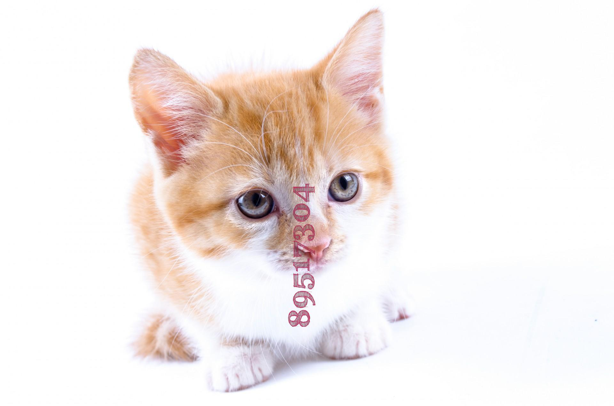

## Synthetic Text On Image Generator with Annotations for Text Detection and Recognition

1. Install required packages as specified in requirements
2. Put source images in source_images folder
3. For changing any split of how the texts should be aligned, change the numbers in config.yml
4. To create synthetic images and their annotations

```python
python3 synth_text_generator.py

```
All synthetic images and the corresponding annotations as a text file will be stored in target folder.
The annotaions are of the form : x1,y1,x2,y2,x3,y3,x4,y4,text

5. To visualize the annotations

```python
python3 visualize_annot.py  -image "test1.jpg"
```

Synthetic Generation


Annotatations

